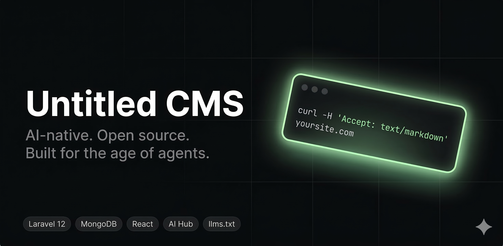

# Untitled CMS

<p align="center">
  <a href="https://github.com/watchtower/untitled-cms/actions/workflows/ci.yml"></a>
  
  
  
  
</p>

<p align="center">
  <strong>An AI-native Content Management System built for the age of agents.</strong><br>
  Laravel 12 · MongoDB · React + Inertia.js · Multi-provider AI Hub · Markdown-for-Agents
</p>

---



---

**Untitled CMS** is a production-ready, open-source CMS that treats AI as a first-class citizen — not an afterthought. Built on a modern monolithic SPA stack, it ships with a full-featured **Media Vault**, a multi-provider **AI Hub** (OpenAI, Gemini, Anthropic, and more), and native **Markdown-for-Agents** delivery so AI crawlers and coding assistants can consume your content directly.

### Why Untitled CMS?

| You want…                        | Untitled CMS gives you…                                                                                      |
| -------------------------------- | ------------------------------------------------------------------------------------------------------------ |
| A CMS that works _with_ AI tools | `/llms.txt`, `/llms-full.txt`, `Accept: text/markdown` on every page, and YAML frontmatter for agents        |
| Secure media management          | 7-stage upload pipeline: double-extension detection → MIME check → image sanitization → optional ClamAV scan |
| Flexible AI integration          | Swap providers at runtime — OpenAI, Anthropic, Gemini, Groq, Mistral, Deepseek, Ollama                       |
| Granular access control          | 34 permissions across 8 policy classes, cached RBAC, invite-only user flow                                   |
| A developer-friendly stack       | Laravel 12 + React + TypeScript + Tailwind CSS + Shadcn UI, all in one repo                                  |
| Easy self-hosting                | Interactive installer, Docker Compose, systemd + Nginx templates                                             |

---

## What's Inside

| Module                  | Highlights                                                                                                                                                                                              |
| ----------------------- | ------------------------------------------------------------------------------------------------------------------------------------------------------------------------------------------------------- |
| **Auth & RBAC**         | Login · Registration · Email verification · Token-based invitations · Granular role/permission system with Laravel Gate policies                                                                        |
| **Pages**               | CKEditor 5 rich text · Draft/Published workflow · SEO meta fields · AI-generated meta · Dynamic public routing · Scheduled publishing                                                                   |
| **Banners**             | Drag-and-drop reordering (`@dnd-kit`) · Active/inactive scheduling with `start_at / end_at`                                                                                                             |
| **The Vault**           | Hierarchical media manager · 3-panel resizable layout · Secure 7-stage upload pipeline · Folder-level permissions · Full audit log · AI-generated alt text                                              |
| **AI Hub**              | Multi-provider manager (OpenAI, Gemini, Anthropic, Groq, Mistral, Deepseek, Ollama) · Per-hub monthly usage tracking · Text generation · SEO meta generation · Vision-based alt text · Image generation |
| **Markdown for Agents** | Every public page responds with clean Markdown + YAML frontmatter when `Accept: text/markdown` is sent — ready for AI crawlers and coding assistants                                                    |
| **`/llms.txt`**         | AI-discoverability standard (llmstxt.org) — index of all published pages for LLM ingestion. `/llms-full.txt` delivers full page content as plain Markdown                                               |
| **Dashboard**           | Analytics cards + Recharts charts · Recent activity feed                                                                                                                                                |
| **Activity Log**        | Comprehensive audit trail for all admin actions, filterable in the admin panel                                                                                                                          |
| **Settings**            | Site-wide key/value settings store · Custom maintenance mode & error pages                                                                                                                              |
| **Menus**               | Drag-and-drop navigation builder                                                                                                                                                                        |
| **Social Login**        | OAuth via Google and GitHub                                                                                                                                                                             |

---

## Requirements

| Requirement  | Version | Notes                                                                     |
| ------------ | ------- | ------------------------------------------------------------------------- |
| **PHP**      | >= 8.2  | Extensions: `mongodb`, `mbstring`, `xml`, `curl`, `zip`, `gd`, `fileinfo` |
| **Composer** | >= 2.0  | [getcomposer.org](https://getcomposer.org)                                |
| **Node.js**  | >= 18   | [nodejs.org](https://nodejs.org)                                          |
| **npm**      | >= 9    | Bundled with Node.js                                                      |
| **MongoDB**  | >= 6.0  | Local install or [Atlas free tier](https://www.mongodb.com/atlas)         |

> **MongoDB PHP extension:** `pecl install mongodb` — see the [official guide](https://www.php.net/manual/en/mongodb.installation.php).

---

## Installation

### Option A — Interactive Installer _(recommended)_

The installer checks prerequisites, walks you through configuration, and prints your login credentials.

```bash
git clone https://github.com/watchtower/untitled-cms.git untitled-cms
cd untitled-cms
bash install.sh
```

### Option B — One-Command Setup

For environments where you already have a `.env` file ready:

```bash
composer run setup
```

Runs in sequence: `composer install` → `.env` copy → `key:generate` → `migrate` → `db:seed` → `npm install` → `npm run build`

### Option C — Manual Step-by-Step

```bash
# 1. Clone
git clone https://github.com/watchtower/untitled-cms.git untitled-cms
cd untitled-cms

# 2. Dependencies
composer install
npm install

# 3. Environment
cp .env.example .env
php artisan key:generate
```

Edit `.env` — set at minimum:

```env
APP_URL=http://localhost:8000

DB_CONNECTION=mongodb
DB_HOST=127.0.0.1
DB_PORT=27017
DB_DATABASE=untitled_cms
```

```bash
# 4. Migrate and seed (roles, admin user, settings, AI providers, sample content)
php artisan migrate --force
php artisan db:seed --force

# 5. Build and serve
npm run build
php artisan serve
```

### Docker

```bash
# Development
docker compose -f docker-compose-dev.yml up

# Production
docker compose up
```

---

## Default Login

After seeding, log in at `http://localhost:8000/login`:

| Field    | Value               |
| -------- | ------------------- |
| Email    | `admin@example.com` |
| Password | `password`          |

> **Change this password immediately after your first login.**

---

## Development

Start all dev services in one command (server + queue worker + log viewer + Vite HMR):

```bash
composer run dev
```

| Command                    | Description                     |
| -------------------------- | ------------------------------- |
| `php artisan serve`        | Laravel dev server on port 8000 |
| `npm run dev`              | Vite dev server with HMR        |
| `php artisan queue:listen` | Process queued jobs             |
| `php artisan pail`         | Real-time log viewer            |
| `composer run test`        | Run PHPUnit test suite          |
| `./vendor/bin/pint`        | PHP code formatter              |

---

## AI for Agents & LLMs

Untitled CMS is designed to be AI-readable out of the box.

### `/llms.txt` — Discovery Index

A standard index of all published pages following the [llmstxt.org](https://llmstxt.org) specification:

```bash
curl https://yoursite.com/llms.txt
```

### `/llms-full.txt` — Full Content for Ingestion

All published pages as plain Markdown — ideal for RAG pipelines:

```bash
curl https://yoursite.com/llms-full.txt
```

### `Accept: text/markdown` — Per-Page Extraction

Every public page supports Markdown delivery with YAML frontmatter:

```bash
# Homepage — Markdown index of recent pages
curl -H "Accept: text/markdown" https://yoursite.com/

# Any page — YAML frontmatter + Markdown body
curl -H "Accept: text/markdown" https://yoursite.com/getting-started
```

Responses include `Content-Signal` and `x-markdown-tokens` headers for AI pipeline compatibility.

---

## Tech Stack

### Backend

| Package                                                                     | Version  | Purpose                            |
| --------------------------------------------------------------------------- | -------- | ---------------------------------- |
| [Laravel](https://laravel.com/)                                             | `^12.0`  | Core framework                     |
| [mongodb/laravel-mongodb](https://github.com/mongodb/laravel-mongodb)       | `^5.5`   | MongoDB ODM                        |
| [laravel/sanctum](https://laravel.com/docs/sanctum)                         | `^4.0`   | Session & token authentication     |
| [laravel/socialite](https://laravel.com/docs/socialite)                     | `^5.24`  | OAuth (Google, GitHub)             |
| [laravel/ai](https://github.com/laravel/ai)                                 | `^0.2.1` | LLM provider abstraction           |
| [inertiajs/inertia-laravel](https://inertiajs.com/)                         | `^2.0`   | Server-side SPA bridge             |
| [intervention/image](https://image.intervention.io/v3)                      | `^3.11`  | Image processing & sanitization    |
| [league/html-to-markdown](https://github.com/thephpleague/html-to-markdown) | `^5.1`   | HTML → Markdown for AI delivery    |
| [mews/purifier](https://github.com/mewebstudio/Purifier)                    | `^3.4`   | HTML sanitization                  |
| [tightenco/ziggy](https://github.com/tighten/ziggy)                         | `^2.0`   | Named Laravel routes in JavaScript |

### Frontend

| Package                                             | Version | Purpose                      |
| --------------------------------------------------- | ------- | ---------------------------- |
| [React](https://reactjs.org/)                       | `^18.2` | UI framework                 |
| TypeScript                                          | `^5.0`  | Type safety                  |
| [Tailwind CSS](https://tailwindcss.com/)            | v4      | Utility-first styling        |
| [Shadcn UI](https://ui.shadcn.com/)                 | latest  | Accessible component library |
| [CKEditor 5](https://ckeditor.com/)                 | `^41`   | Rich text editor             |
| [@dnd-kit](https://dndkit.com/)                     | `^6`    | Drag-and-drop                |
| [@tanstack/react-table](https://tanstack.com/table) | `^8`    | Headless data tables         |
| [Recharts](https://recharts.org/)                   | `^2`    | Dashboard charts             |
| [Sonner](https://sonner.emilkowal.ski/)             | `^2`    | Toast notifications          |
| [Zod](https://zod.dev/)                             | `^4`    | Frontend schema validation   |

---

## Architecture Overview

```
┌─────────────────────────────────────────────────────┐
│                    Public Web                        │
│  / → PublicController (HTML or Markdown response)   │
│  /{slug} → Page with YAML frontmatter               │
│  /llms.txt → AI discovery index                     │
│  /llms-full.txt → Full content for LLM ingestion    │
└──────────────────┬──────────────────────────────────┘
                   │ Accept: text/markdown  /  curl
                   ▼
          AI Crawlers / Agents / RAG Pipelines

┌──────────────────────────────────────────────────────┐
│                  Admin SPA                            │
│  Inertia.js + React + TypeScript                     │
│                                                      │
│  Routes → Controllers → MongoDB Models               │
│                     ↓                                │
│  AI Hub → AiService → OpenAI / Gemini / Anthropic    │
│                     ↓                                │
│  Vault Upload → Pipeline (7 pipes) → Storage         │
└──────────────────────────────────────────────────────┘
```

**Key design decisions:**

- **MongoDB throughout** — Flexible document model for pages, vault metadata, activity logs, and AI usage tracking.
- **Monolithic SPA** — Laravel renders the initial Inertia page; React handles all subsequent navigation. No separate API server.
- **Upload Pipeline** — Vault uploads pass through an ordered `Pipe` chain: `DetectDoubleExtension → ValidateMimeType → SanitizeImage → ModerationCheck → SandboxedScan → GenerateUuid → StoreMetadata`.
- **Single Active AI Hub** — One hub is "active" at a time; `AiService` dynamically patches Laravel AI's config at runtime so no restart is required when switching providers.
- **AI-readable by default** — `Accept: text/markdown`, `/llms.txt`, and `/llms-full.txt` are built in, not bolted on.

---

## AI Hub Setup

1. Navigate to **Admin → AI Hubs**
2. Enter your API key for a provider (OpenAI, Anthropic, Gemini, etc.)
3. Set a default text model and image model
4. Click **Activate**

No API keys are stored in config files — all configuration is done at runtime via the admin UI.

---

## Optional Configuration

### Social Login

Add OAuth credentials to `.env`, then enable in **Admin → Settings → Auth**:

```env
# Google — https://console.cloud.google.com/apis/credentials
GOOGLE_CLIENT_ID=your-client-id
GOOGLE_CLIENT_SECRET=your-client-secret

# GitHub — https://github.com/settings/developers
GITHUB_CLIENT_ID=your-client-id
GITHUB_CLIENT_SECRET=your-client-secret
```

### ClamAV (Virus Scanning)

Optional antivirus scanning for vault uploads. Disabled by default:

```env
CLAMAV_ENABLED=true
```

Requires ClamAV installed and running locally.

---

## Commands Reference

| Command                            | Description                                        |
| ---------------------------------- | -------------------------------------------------- |
| `bash install.sh`                  | Interactive first-time installer                   |
| `composer run setup`               | Non-interactive full setup                         |
| `composer run dev`                 | Start all dev services (server, queue, logs, Vite) |
| `composer run test`                | Run PHPUnit test suite                             |
| `./vendor/bin/pint`                | PHP code formatter (Laravel Pint)                  |
| `npm run dev`                      | Vite dev server with HMR only                      |
| `npm run build`                    | Production frontend build                          |
| `php artisan db:seed --force`      | Re-seed the database                               |
| `php artisan migrate:fresh --seed` | Wipe and re-seed (dev only)                        |

---

## Deployment

See [docs/deployment.md](docs/deployment.md) for a full production deployment guide — including Nginx config, systemd queue worker, SSL, and multi-server scaling.

Scripts at the project root:

- `deploy.sh` — Git pull + asset build + cache clear
- `backup.sh` — MongoDB backup script

---

## Feature Roadmap

### Shipped ✓

- Authentication (Login, Register, Forgot/Reset Password, Email Verification)
- Token-based user invitation flow
- Granular RBAC — Roles, Permissions, Laravel Gate policies
- Social login (Google, GitHub)
- Users module (CRUD, soft-delete, avatar, batch actions, logout all devices)
- Pages module (CKEditor 5, SEO fields, Draft/Published, dynamic routing)
- Banners module (drag-and-drop reorder, scheduling)
- The Vault — hierarchical media manager with secure 7-stage upload pipeline
- VaultPicker — reusable media selection component
- AI Hub — multi-provider manager (OpenAI, Anthropic, Gemini, Deepseek, Groq, Mistral, Ollama)
- AI text generation, SEO meta generation, vision alt-text, image generation
- Dashboard with Recharts analytics
- Activity log — filterable audit trail
- **`/llms.txt` + `/llms-full.txt`** — AI-discoverability standard
- Markdown-for-Agents (`Accept: text/markdown` + YAML frontmatter)
- Sitemap for agents (`/sitemap.md`)
- RSS feed
- Settings — admin-configurable key/value store
- Dark mode, responsive layouts, Shadcn UI
- Maintenance mode with admin bypass and custom error pages
- Enhanced security (OWASP Top 10 mitigation, SSRF protection)
- Strict typing via DTOs and Form Requests
- Navigation / menus system
- GitHub Actions CI (tests, linting, security audit, frontend build)

### Planned

- [ ] **Page versioning** — revision history with diff viewer and restore
- [ ] **Full-text search** — `Cmd+K` command palette across Pages, Users, Vault
- [ ] **Webhook system** — Trigger HTTP webhooks on `page.published`, `vault.uploaded`, etc.
- [ ] **REST API layer** — Sanctum-protected API for headless consumption
- [ ] **2FA** — TOTP two-factor authentication for admin accounts
- [ ] **Page view tracking** — Anonymous analytics in the dashboard
- [ ] **Notification system** — In-app / email / push with per-user preferences

---

## Contributing

See [CONTRIBUTING.md](CONTRIBUTING.md) for guidelines, coding standards, and the module creation walkthrough.

---

## Security

Please report vulnerabilities privately — see [SECURITY.md](SECURITY.md).

---

## Changelog

See [CHANGELOG.md](CHANGELOG.md) for a full history of releases and changes. Current version: **0.2.0**.

---

## License

This project is open-sourced software licensed under the [MIT license](LICENSE).
